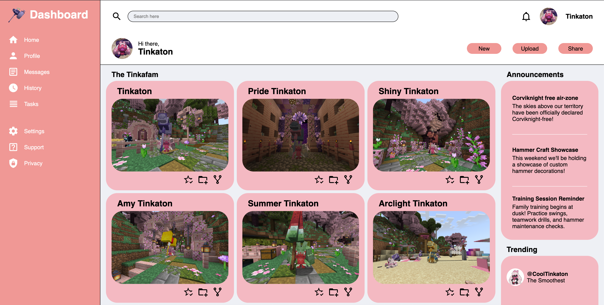

# AdminDashboard
A basic admin dashboard layout inspired by The Odin Project (TOP), and partially an excuse to show off my favorite pokemon Tinkaton!

## Preview

## Provided Assets
SVG Icon Library: [Material Design Icons](https://materialdesignicons.com/)

## How to Run Locally
1. Clone the repository:
2. Navigate to the project directory
3. Open index.html in your browser or visit the live version of the game [HERE](https://santi-raigoza.github.io/AdminDashboard/).

